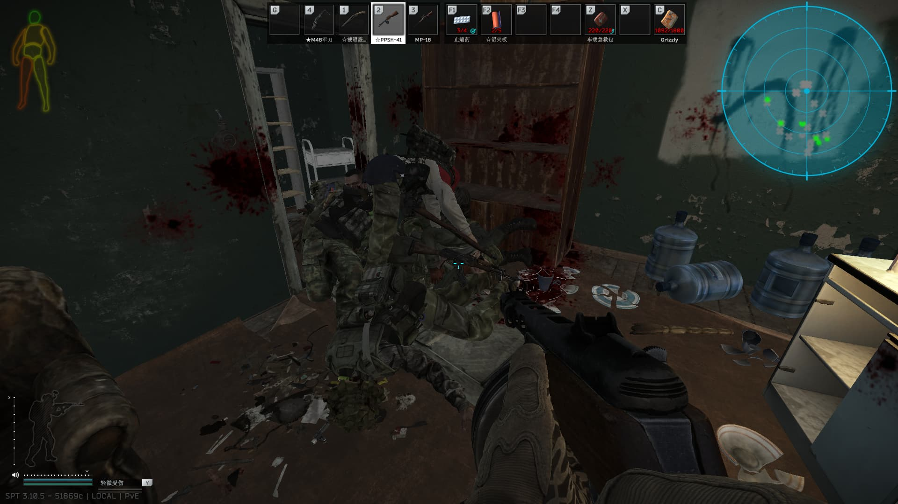
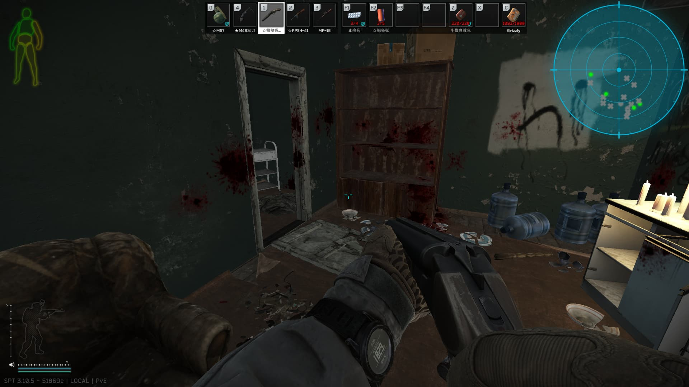

### usage
focus on the target corpse, follow the interact indicator (AKA action menu)

### compatibility
check release note for SPT version, works fine with **DynamicMaps** and **TyrianRadar**, but **DynamicMaps** may still shown deleted corpse

you may need this [SPTLootFetching](https://github.com/ragnaroks/SPTLootFetching)

### preview
|before|after|
|-|-|
|||